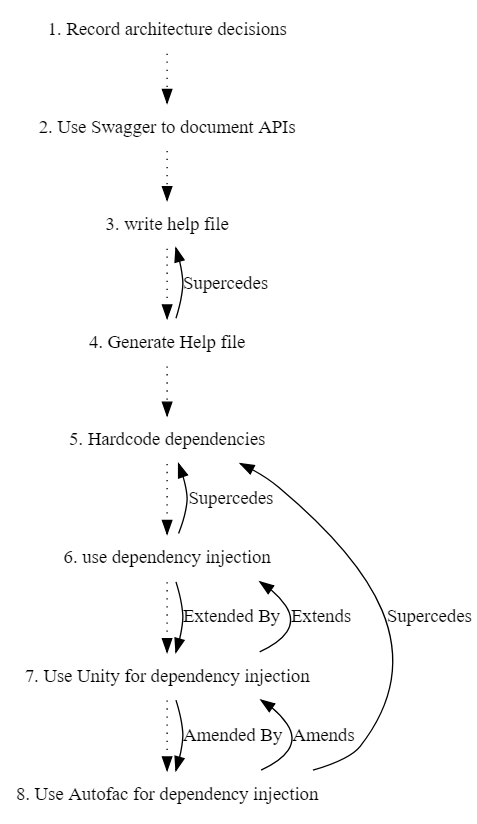

# ADR Demo

Demo project to showcase how to manage ADR using [adr-tools](https://github.com/npryce/adr-tools)


## Demo Steps

### Step 1

Create a new git project using [Git Flow](https://github.com/nvie/gitflow) and add README file

### Step 2

Initialize adr using following command

```
adr init

```

This will create doc/adr directory and will add first ADR to this directory. First ADR just documents the fact that we are going to use ADR for documenting all our architecure decisions

### Step 3

Adda a new ADR using

```
adr new Use Swagger to document APIs
```

This will creae a new ADR file named doc/adr/0002-use-swagger-to-document-apis.md. As this is demo only so we are not updating content of ADR file but in real world this should explain why are we using swagger. Although in case of swagger real question would be why you are not using swagger

The file will look something like this

```
Date: 2018-09-17

## Status

Accepted

## Context

The issue motivating this decision, and any context that influences or constrains the decision.

## Decision

The change that we're proposing or have agreed to implement.

## Consequences

What becomes easier or more difficult to do and any risks introduced by the change that will need to be mitigated.

```

### Step 4

Let's see how supersede works. For this we will add two ADRs. One that will be superseded and second one that will supersede first one.

Let's first create ADR that will be superseded.

```
adr new write help file
```

This will create file doc/adr/0003-write-help-file.md with contents

```
# 3. write help file

Date: 2018-09-17

## Status

Accepted

## Context

The issue motivating this decision, and any context that influences or constrains the decision.

## Decision

The change that we're proposing or have agreed to implement.

## Consequences

What becomes easier or more difficult to do and any risks introduced by the change that will need to be mitigated.

```

let's now add file that will supersede ADR we just added

```
adr new -s 3 Generate Help file
```

This will add a new adr doc/adr/0004-generate-help-file.md  and will update existing file doc/adr/0003-write-help-file.md

doc/adr/0004-generate-help-file.md will contain link to file that it supersedes

```

# 4. Generate Help file

Date: 2018-09-17

## Status

Accepted

Supercedes [3. write help file](0003-write-help-file.md)

## Context

The issue motivating this decision, and any context that influences or constrains the decision.

## Decision

The change that we're proposing or have agreed to implement.

## Consequences

What becomes easier or more difficult to do and any risks introduced by the change that will need to be mitigated.

```

Similarly doc/adr/0003-write-help-file.md will contain link to file that it is  superceded by

```
# 3. write help file

Date: 2018-09-17

## Status

Superceded by [4. Generate Help file](0004-generate-help-file.md)

## Context

The issue motivating this decision, and any context that influences or constrains the decision.

## Decision

The change that we're proposing or have agreed to implement.

## Consequences

What becomes easier or more difficult to do and any risks introduced by the change that will need to be mitigated.


```

### Step 5

Supersede is not the only type of link that can exist between two ADRs. You are free to create any link you want. E.g if an ADR amends an existing ADR you can create Amends and Amended By or if an ADR extends then you can create Extends and Extended by. A single ADR can supersede and link to multiple existing ADRs

Let's take a look at an example

```bash
$ adr new Hardcode dependencies
$ adr new -s 5 use dependency injection
$ adr new -l "6:Extends:Extended By" Use Unity for dependency  injection
$ adr new -s 5 -l "7:Amends:Amended By" Use Autofac for dependency injection

```


Content of these files after running all command will look like this


doc/adr/0005-hardcode-dependencies.md

```
# 5. Hardcode dependencies

Date: 2018-09-17

## Status

Superceded by [6. use dependency injection](0006-use-dependency-injection.md)

Superceded by [8. Use Autofac for dependency injection](0008-use-autofac-for-dependency-injection.md)

## Context

The issue motivating this decision, and any context that influences or constrains the decision.

## Decision

The change that we're proposing or have agreed to implement.

## Consequences

What becomes easier or more difficult to do and any risks introduced by the change that will need to be mitigated.

```

doc/adr/0006-use-dependency-injection.md
```
# 6. use dependency injection

Date: 2018-09-17

## Status

Accepted

Supercedes [5. Hardcode dependencies](0005-hardcode-dependencies.md)

Extended By [7. Use Unity for dependency injection](0007-use-unity-for-dependency-injection.md)

## Context

The issue motivating this decision, and any context that influences or constrains the decision.

## Decision

The change that we're proposing or have agreed to implement.

## Consequences

What becomes easier or more difficult to do and any risks introduced by the change that will need to be mitigated.


```

doc/adr/0007-use-unity-for-dependency-injection.md
```

# 7. Use Unity for dependency injection

Date: 2018-09-17

## Status

Accepted

Extends [6. use dependency injection](0006-use-dependency-injection.md)

Amended By [8. Use Autofac for dependency injection](0008-use-autofac-for-dependency-injection.md)

## Context

The issue motivating this decision, and any context that influences or constrains the decision.

## Decision

The change that we're proposing or have agreed to implement.

## Consequences

What becomes easier or more difficult to do and any risks introduced by the change that will need to be mitigated.

```

doc/adr/0008-use-autofac-for-dependency-injection.md
```
# 8. Use Autofac for dependency injection

Date: 2018-09-17

## Status

Accepted

Supercedes [5. Hardcode dependencies](0005-hardcode-dependencies.md)

Amends [7. Use Unity for dependency injection](0007-use-unity-for-dependency-injection.md)

## Context

The issue motivating this decision, and any context that influences or constrains the decision.

## Decision

The change that we're proposing or have agreed to implement.

## Consequences

What becomes easier or more difficult to do and any risks introduced by the change that will need to be mitigated.


```


You can generate a graph showing dependencies using

```
adr generate graph
```

This will generate

```
digraph {
  node [shape=plaintext];
  subgraph {
    _1 [label="1. Record architecture decisions"; URL="0001-record-architecture-decisions.html"];
    _2 [label="2. Use Swagger to document APIs"; URL="0002-use-swagger-to-document-apis.html"];
    _1 -> _2 [style="dotted", weight=1];
    _3 [label="3. write help file"; URL="0003-write-help-file.html"];
    _2 -> _3 [style="dotted", weight=1];
    _4 [label="4. Generate Help file"; URL="0004-generate-help-file.html"];
    _3 -> _4 [style="dotted", weight=1];
    _5 [label="5. Hardcode dependencies"; URL="0005-hardcode-dependencies.html"];
    _4 -> _5 [style="dotted", weight=1];
    _6 [label="6. use dependency injection"; URL="0006-use-dependency-injection.html"];
    _5 -> _6 [style="dotted", weight=1];
    _7 [label="7. Use Unity for dependency injection"; URL="0007-use-unity-for-dependency-injection.html"];
    _6 -> _7 [style="dotted", weight=1];
    _8 [label="8. Use Autofac for dependency injection"; URL="0008-use-autofac-for-dependency-injection.html"];
    _7 -> _8 [style="dotted", weight=1];
  }
  _4 -> _3 [label="Supercedes", weight=0]
  _6 -> _5 [label="Supercedes", weight=0]
  _6 -> _7 [label="Extended By", weight=0]
  _7 -> _6 [label="Extends", weight=0]
  _7 -> _8 [label="Amended By", weight=0]
  _8 -> _5 [label="Supercedes", weight=0]
  _8 -> _7 [label="Amends", weight=0]
}

```


Run it through graphviz to generate actual graph


